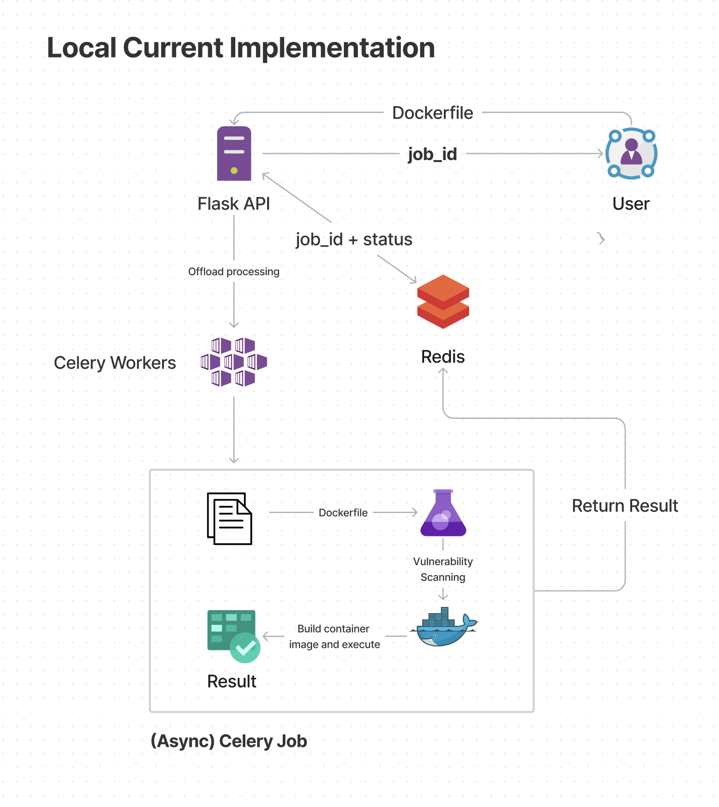

# Owkin Docker Service

by Mustafa Al Quraishi

1. **Overview of System**

   This is an implementation of a Python service that receives a Dockerfile and returns a job_id, which then can be used to check the status and performance of subsequent execution of the Dockerfile. This service is built with Flask API, Celery Workers for async processing, Redis KV store for job_id status storage and utilises Docker SDK for local processing.

2. **Project Structure**

   The root of the directory is the `run.py` file which runs the Flask API.

   The structure is as follows:

   ```
   .
   ├── run.py
   ├── experiment_summaries
   └── backend
      ├── index.py
      ├── config/
      └── api/
   ```

   The backend consists of `index.py` which contains all configured routes. The handler for these routes can be found in the `api/` directory. The `config/` directory contains all Celery Worker and Flask App configurations, along with `schema.py` which contains the beginnings of the route schema validation framework.

   All Dockerfile jobs performances are stored in the experiment_summaries directory, in the following structure. Each job is given a unique `job_id` in `uuid4()` format.

   ```
   experiment_summaries
      └── 123e4567-e89b-12d3-a456-426614174000 (this is an example UUID)/
         ├── Dockerfile
            └── data
            └── perf.json
   ```

3. **Outline of Specification**

   After reading the project brief the following considerations and core specifications are outlined.

   **Core Specifications:**

   - Submit a dockerfile and return a job ID.
   - Retrieve the status and performance if it exists associated with the job.
   - Build the Image from the Dockerfile
   - Check the Vulnerability of the Image for Security
   - Executes the container in the most secure environment possible and associates to the job the performance (the decimal) and success status.
   - Assign Failure status if any of the checks aforementioned fail.

   **Considerations:**

   - Any job submission and executions must be asynchronous to allow the service to serve multiple requests efficiently without overloading service.
   - A method for deducing the vulnerability of a Docker image must be decided upon.
   - Configure execution of Docker container to be secure, and clean up container after execution.

4. **System Implementation**

   The system is implemented with the following technologies:

   - Flask API: For handling requests and responses.
   - Celery Workers: For asynchronous processing of Dockerfile jobs.
   - Redis KV Store: For storing job_id status.

5. **System Diagram**

   The basic implementation of the system is as follows:

    

6. **Docker Image Vulnerability Scanning**

   For vulnerability scanning of the received docker file, we implement two main checks:

   - **Initial read of the dockerfile to check for any commands that may be malicious or harmful to the system.**

     The following commands are checked for, this is mostly derived from online search and looking at common machine learning workload dockerfiles such as those used in Substra.

     Example Substra dockerfile:

     ```
     FROM ghcr.io/substra/substra-tools:0.20.0-nvidiacuda11.8.0-base-ubuntu22.04-python3.10

     # install dependencies
     RUN python3.10 -m pip install -U pip

     # Install substrafl, substra (and substratools if editable mode)


     # PyPi dependencies
     RUN python3.10 -m pip install --no-cache-dir torch==1.11.0

     # Install local dependencies


     ENTRYPOINT ["python3.10", "function.py", "--function-name", "train"]

     COPY . .
     ```

     - `root` - This is a security risk as it allows the container to run as root, such as `USER root`.
     - `EXPOSE` - This is a security risk as it allows the container to expose ports.
     - `ADD` - This is a security risk as it allows the container to add files from the host machine to the container.

   - **After building the image, we scan the image for any vulnerabilities using the `trivy` tool.**

     [Trivy]('https://github.com/aquasecurity/trivy') is a popular comprehensive and versatile security scanner. Trivy has scanners that look for security issues, and targets where it can find those issues in the container image. If there is a single `HIGH` vulnerability, the container does not execute. Trivy is a static analysis tool, meaning it doesn’t run the container image, but instead looks at the container image file system and metadata.

     After some thoughts, I would perhaps opt to drop the first step, and only use Trivy for vulnerability scanning. Opting for vulnerability scanning as opposed to static string matching is a more robust approach, and less restrictive to potential users of the service. Moreover we could alter the threshold of vulnerability to allow for more or less vulnerabilities to be accepted, depending on further testing.

7. **Docker Secure Execution Environment**

   We read up on the [following resource]('https://cheatsheetseries.owasp.org/cheatsheets/Docker_Security_Cheat_Sheet.html#dockerfile-security-best-practices') to understand how to execute a docker container in a secure environment.

   Basic implementation of secure environments for docker container executions includes using the following flags:

   - `user="nobody"`: The Docker container is run as the nobody user. This is a built-in unprivileged user in many Linux systems. Running a Docker container as an unprivileged user increases security by decreasing the potential attack surface. We assume the application does not need root permissions, so it's a good practice to run it as an unprivileged user.

   - `cap_drop=["ALL"]`: This drops all Linux capabilities from the Docker container. Linux capabilities determine what privileges a process has, such as being able to bind to well-known ports, alter the system clock, and so on. By dropping all capabilities, we limit what a process can do, reducing the risk if the process or container is compromised.

   - `volumes={f'{dockerfile_dir}/data': {'bind': '/data', 'mode': 'rw'}}`: The mode 'rw' means the mount is read-write, so the container can read from and write to the directory. This allows us to control the access the container has to the host's filesystem. In this case, the container can only read and write to the {dockerfile_dir}/data directory. Ideally we would mount a volume with the read-only mode, but the container needs to write to the /data directory, so we need to mount it with the read-write mode.

8. **Redis Implementation**

   We opted for this over a typical relational database as it is a simple key-value store, and we do not need to store any complex data structures. We also do not need to store any relational data, and we can simply store the job_id and status of the job.

   Redis is also very fast, and can handle a large number of requests per second.

9. **Celery Implementation**

   We opted for Celery as it is a simple and easy-to-use asynchronous task queue. It is also very easy to integrate with Flask, and allows us to easily scale the number of workers to handle more requests.

   Celery also allows us to easily retry tasks if they fail, and we can also set a time limit for tasks. This is useful for preventing tasks from running for too long, and also for retrying tasks if they fail.

10. **Ratelimiting**

    We opted for a simple rate limiter using the Flask-Limiter library. This allows us to limit the number of requests per minute to the API. We can also configure the rate limiter to allow 10 requests per minute, and then block any requests after that. This is useful for preventing DDOS attacks.

11. **Code Quality Control**

    We opted for the following code quality control measures:

    - autopep8: For formatting code.
    - Commenting and docstrings: For documenting code.
    - Exception handling: For handling errors.
    - Unit tests: For testing code. We use pytest for unit testing.

12. **What we would have done with more time**

    - **Allow users to upload multiple files** - We would have allowed users to upload multiple files, allowing the Dockerfile to have external file dependencies such as requirements.txt.

    - **More tests** - We would have written more tests to cover more edge cases. This includes testing internal functions and testing more edge cases for the API. We would also have written more tests for the Dockerfile checks.

    - **More security checks** - Implemented more security checks for the Dockerfile. This includes checking for more commands that may be harmful to the system. This requires more reading and understanding.

    - **Clean up Docker mode** - Docker in Docker approach introduces a bit more complexity, and forced me to define root host directory path to allow permissioned mounting of volumes. I would like to tidy up this approach and find a way to avoid having to configure an `.env` variable. Promising resources I may continue reading include [1]('https://github.com/kevana/ui-for-docker/tree/master') and [2]('https://www.reddit.com/r/docker/comments/5qdhq7/spawning_containers_from_within_a_container/').

    - **Implement Remote mode** - This would include uses of Kubernetes, a better way of orchestrating our containers and perhaps bypass the issues found of the 'Docker In Docker' approach in Docker Mode.

      The steps include setting up services for the Flask API, Celery workers and Redis, and then setting up a Kubernetes cluster to manage the services. I pseudo-implemented a couple of steps but did not have enough time to fully implement this (see `remote/`). As it required management of the docker registry, I did not extract the Dockerfile logic for each service into separate Dockerfiles and instead used a single Dockerfile for the entire application. This would have been resolved if I had more time.

      This would also require some thought into retooling the logic as we must consider how to manage the dockerfiles, and how to dynamically load them into the cluster.

13. **Taking the system to production**

    We would deploy the system to production with an outline of the following steps:

    - **CI/CD Integration:** i.e. CircleCI to automatically build Docker images, run tests, push images to a Docker registry, and update deployments in Kubernetes cluster.

    - **Containerize the Application:** Write dockerfiles for the flask api, celery workers and redis. This allows us to easily deploy the application to any environment.

    - **Docker Registry:** Use Docker Hub or Google Container Registry. Push built docker images to registry, where they can be pulled by our Kubernetes nodes.

    - **Google Kubernetes Engine (GKE):** Deploying, scaling, and managing containerised applications using Google Infrastructure. This allows us to easily scale the application, and manage the application in a production environment.

    - **Set up networking:** Kubernetes ingress: This allows us to route traffic to the correct services, ensuring security and load balancing.

    - **Set up security (IAM):** Authorise who can take action on specific resources.

    - **Logging:** i.e. DataDog, StackDriver, etc. This allows us to monitor the application, and debug any issues.

    - **Health Checks:** With i.e. Datadog we can set up interval automated API invocations on endpoints of our API to check celery, redis and flask applications are alive. We have this preliminary set up in `index.py` with `/celery/ping`.
